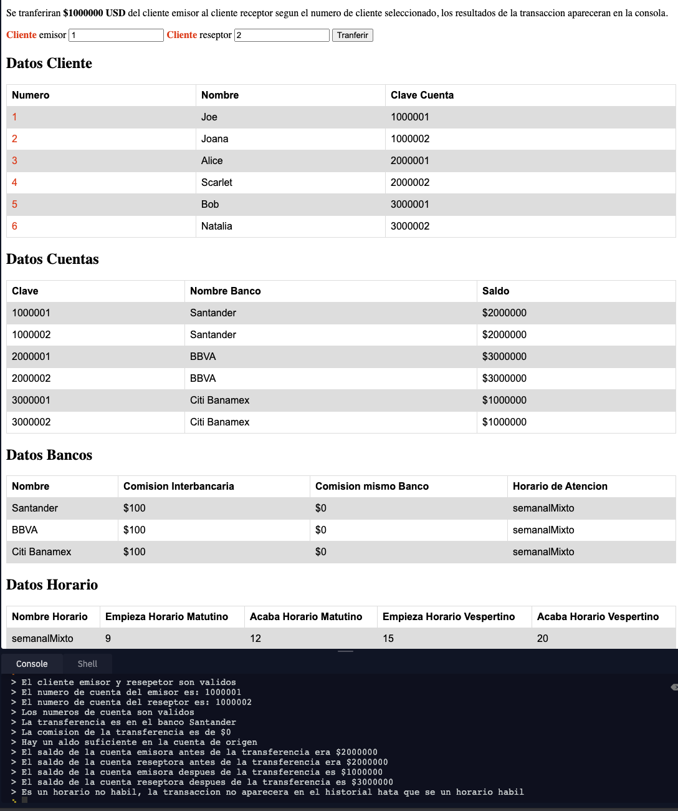

# Transferencia interbancaria

## Bienvenido! 👋

## Se tiene

* Banco cliente
* Cuenta cliente
* Banco destino
* Cuenta destino
* Hora de transferencia [0-24]

## Objetivo

Transferir 1000000 USD

## Condiciones obligatorias de transferencia

* Cliente verificado (verdadero o falso) ✔️
* Destino verificado (verdadero o falso) ✔️
* Saldo mayor al monto a transferir más costo de transacción ✔️

## Parametros del costo de transacción

* Si el banco destino es el mismo al banco de cliente el costo de transacción es 0 USD ✔️
* Si el banco destino es diferente al banco de cliente el costo de transacción es 100 USD ✔️
* Solo se pueden hacer transferencias en hora de 9  a 12, o de 15 a 20 horas ✔️

> Intenta hacer todo organizado por multiples lineas de codigo y tambien en un solo if ✔️
